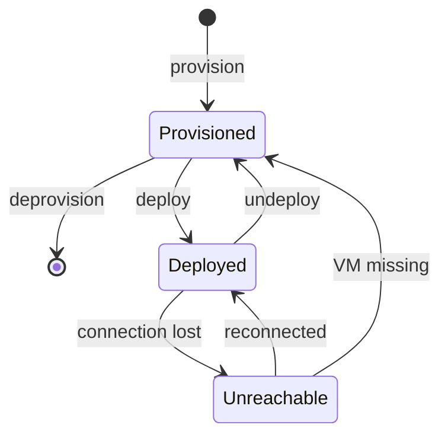

# Engine ideas
## VM descriptor

The descriptor object stores:

### 🧩 VM Descriptor Schema

#### 🔹 Descriptor Properties

| Property             | Description                                                                 | Persistent | Mutable     | Notes |
|----------------------|------------------------------------------------------------------------------|------------|-------------|-------|
| `status`             | Descriptor state: `provisioned`, `created`, `unreachable`                   | Yes        | No          | Changed by the orchestrator |
| `VM_id`              | Hypervisor ID assigned during deployment                                    | Yes        | No          | Error if still in state "provisioned" |
| `full_name`          | Full path name `/parent/other/name`                                         | Yes        | Only while `provisioned` | Key used by the orchestrator; may move folders and adjust permissions |
| `name`               | Pathless name computed at runtime                                           | No         | No          | Derived from `full_name` |
| `local_definition`   | Local definition parameters                                                 | Yes        | Only while `provisioned` | See definitions section |
| `computed_definition`| Merge of inherited and local definition                                     | No         | No          | Computed at runtime with cascading inheritance |
| `deployed_config`    | Snapshot taken at deployment from `computed_definition`                     | Yes        | No          | Useful to spot unintended changes |

---

### 🔸 Definition Parameters

#### 🖥️ Hypervisors

| Parameter                 | Description                                      | Type                             | YAML Example |
|---------------------------|--------------------------------------------------|----------------------------------|--------------|
| `hypervisors`             | Hypervisor definitions                           | `dict[string, hypervisor_def]`   | `EXXi_1: { host, user, password }` |
| `use_hypervisor`          | Name of the hypervisor to use                    | `string`                         | `use_hypervisor: ESXi_1` |
| `host`, `user`, `password`| Derived from `use_hypervisor`                    | `string`                         | — |
| `hypervisor_type`         | Hypervisor type (`VMWare`, `Proxmox`, etc.)      | `string`                         | — |
| `filter_hypervisors_allow`| List of allowed hypervisors                      | `[string]`                       | `[ESXi_1, PR2]` |

#### 🧬 Prototypes

| Parameter                 | Description                                      | Type                             | YAML Example |
|---------------------------|--------------------------------------------------|----------------------------------|--------------|
| `prototypes`              | Prototype definitions                            | `dict[string, prototype_def]`    | `proto_docker: { base_image, vcpu, memory }` |
| `use_prototype`           | Name of the prototype to use                     | `string`                         | `use_prototype: proto_docker` |
| `base_image`, `vcpu`, `memory` | Derived from `use_prototype`                | `string`, `int`, `string(*)`     | — |

Other properties:
 - The connector to the VM  .MV
    - VM operations are done in that: e.g. descip1.VM.start()
Future characteristics: 
 - Last Error. Stores the last error or warning on None
 - Last operation. Metadata of last operation on the descriptor

 - Mark when a operation is being executed, only for async tasks. Only in memory, not saved on disk.

### Methods
- Provision (Create). Normally, created by a folder.
- Deprovision. The VM must be undeployed.
- Deploy
- Undeploy (What do we do with the resources (Virtual disks...))
- Disconected_notify. Called when an exception of that type raises.
- Reconnected_notify. Called when got reconnect.
- Missing_notify.
- Save. To save data to disk. Calls Storage.

## Operations (draft)
An operation has a target object, or more than one, e.g., some VM descriptors.
There is a operations Queue, with requests and results. That Queue has some 

Metadata of operations is logged. The operation and the result.

I am thinking in this: When a client sends a command ( any kind), inernally, a command object is created, with a unique command number. It is an async operation, usually. So It returns the command number, and a message like "pending". The engine tries to execute the command.
For the sync commands: return the result, or warning or error.
For async commands: when done, store the result in a Results Queue.
 If success, it stores the result in the Executed commands Queue. Also a small line to the log, just with the metadata of the command

## Storage
 Object that loads and saves descriptors
 Methods:
 - Load_tree: load all from disk, return a new tree.
 - Save_descriptor: saves a single descriptor
 Singleton by the moment: module. If in the future we want more than one, change to object and store a reference in the tree. The tree is also a singleton by now.

## Descriptors_tree
Tree struture in memory that holds all the descriptors.
It has folders and descriptors inside. 
Methods:
 - tree[full_path]: returns the descriptor referenced in that full path

### Folder
Each fodler has a reference to its parent. If None, is the root folder.
Methods:
 - Remove. only if empty
 - Is_root
 - Create_sub_folder
 - Provision a VM = create a descriptor
 - List_sub_folders_
 - List descriptors
 - folder[name] returns the descriptor with that name